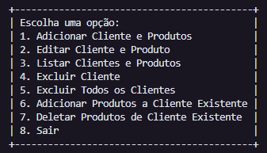
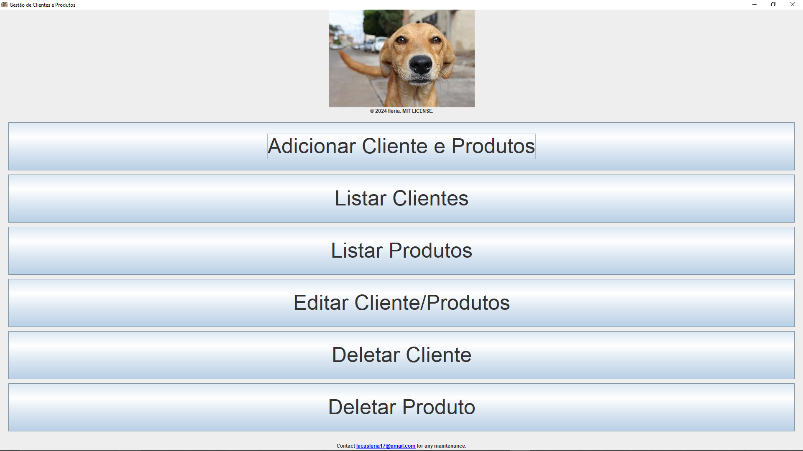

# 📦 Sistema Gerenciador de Estoque em Java  

**Aplicação Java para gestão de estoque com versões CLI e GUI**

[](LICENSE)
[]()
[]()
[]()

## 📌 Sumário

1. [Sobre o Projeto](#-sobre-o-projeto)  
2. [Objetivos](#-objetivos)  
3. [Tecnologias](#-tecnologias)  
4. [Funcionalidades](#-funcionalidades)  
5. [Pré-requisitos](#%EF%B8%8F-pré-requisitos)  
6. [Instalação](#%EF%B8%8F-instalação)  
7. [Como utilizar](#-como-utilizar)
8. [Estrutura do Projeto](#-estrutura-do-projeto)
9. [Contribuição](#-contribuição)  
10. [Licença](#-licença)  
11. [Contato](#-contato)  
12. [Recursos Adicionais](#-recursos-adicionais)  

## 💻 Sobre o Projeto  

O **Sistema Gerenciador de Estoque em Java** é um projeto de extensão acadêmica  que demonstra a aplicação dos princípios de Programação Orientada a Objetos. Surgiu da necessidade de uma comerciante local que geria pedidos manualmente via WhatsApp e caderno, demandando 2+ horas diárias

- **Motivação**: Aplicar conceitos avançados de POO para resolver um problema real da comunidade
- **Público-alvo**: Bancada avaliadora, estudantes de programação, e pequenos comerciantes
- **Problema resolvido**: Automatização de tarefas manuais de gestão de pedidos
- **Diferenciais**: 
  - Duas interfaces (CLI para aprendizado e GUI para uso prático)
  - Integração com banco de dados e planilhas Google Sheets
  - Programação paralela com threads para melhor experiência
- **Metodologia**: Desenvolvimento ágil com princípios SOLID  

## 🎯 Objetivos  

### 🛠 Técnicos  
- Implementar os 5 pilares essenciais:
  1. Programação paralela com Threads
  2. Herança e reutilização de código
  3. Manipulação robusta de exceções
  4. Uso de interfaces e classes abstratas
  5. Integração JDBC com banco de dados
- Aplicar padrões SOLID de arquitetura

### 📚 Acadêmicos  
- Dominar Java em 4 semanas (partindo de conhecimento prévio em Python)
- Documentar todo o processo de aprendizado
- Compartilhar conhecimento com aspirantes a desenvolvedores

### 🌍 Sociais  
- Reduzir em 80% o tempo de gestão manual da comerciante beneficiada
- Capacitar 5+ jovens da comunidade com noções de POO
- Promover inclusão digital para pequenos comerciantes  

## 🚀 Tecnologias  

**Núcleo do Sistema**  
- Java SE (com Swing para GUI)
- JDBC (MySQL Connector)
- Programação Multithread

**Banco de Dados & Integração**  
- MySQL 8.0
- Google Sheets API

**Ferramentas**  
- Maven (gerenciamento de dependências)

## ✨ Funcionalidades  

### 📟 Versão CLI (Educacional)
- ✅ **CRUD Completo** com tratamento de exceções
- ✅ **Menu interativo** com loops aninhados
- ✅ **Operações em lote** (exclusão múltipla)

### 🖥 Versão GUI (Produtiva)
- ✅ **Importação automática** de planilhas Google Sheets
- ✅ **Telas de loading** durante operações demoradas
- ✅ **Validação robusta** de entradas do usuário
- ✅ **Relatórios visuais** de estoque e clientes
- ✅ **Backup automático** dos dados

## ⚙ Pré-requisitos  

- Java JDK 17+ (com JRE configurado)
- MySQL 8.0+ (ou serviço equivalente)
- Credenciais Google API (para Sheets)
- 2GB+ RAM (4GB recomendado)
- Conexão estável à internet  

## 🛠 Instalação  

1. Clone o repositório:

```bash
git clone https://github.com/lucasgleria/projeto-de-extensao.git
```

2. Configure o ambiente:

```bash
# Configure o banco de dados (script incluído em /db)
mysql -u root -p < db/setup.sql

# Atualize as credenciais
nano src/db/config.properties
```

3. Construa o projeto:
```bash
mvn clean package
```

## ❗ Como Utilizar

### Modo Desenvolvedor (CLI):
```bash
java -jar target/estoque-cli.jar --educacional
```

### Modo Produção (GUI):
```bash
java -jar target/estoque-gui.jar
```

### ▶ Demonstração



_Menu hierárquico da versão CLI_



_Painel principal da versão GUI_


## 📂 Arquitetura do Sistema  

```plaintext
src/
├── model/              # Entidades de negócio (Cliente, Produto)
├── dao/                # Padrão Data Access Object
├── service/            # Lógica de negócio
├── interfaces/         # Contratos (IClienteRepository, etc.)
├── thread/             # Processos paralelos
├── utils/              # Helpers e validadores
└── db/                 # Conexão JDBC e migrações
```

## 🤝 Contribuição
Contribuições são bem-vindas! Siga estas etapas:

1. Reporte bugs: Abra uma [issue](https://github.com/lucasgleria/projeto-de-extensao/issues) no GitHub.
2. Sugira melhorias: Envie ideias ou pull requests com novas funcionalidades.
3. Desenvolva:
- Faça um fork do projeto.
- Crie uma branch (git checkout -b feature/nova-funcionalidade).
- Envie um Pull Request.

## 📜 Licença  

Distribuído sob licença MIT. Veja [LICENSE](LICENSE) para mais informações. 

## 📞 Contato
- **Autor**: [Lucas Leria](https://github.com/lucasgleria)
- **LinkedIn**: [lucasgleria](https://www.linkedin.com/in/lucasgleria/)  

## 🔍 Recursos Adicionais

- [Artigo Técnico](images/artigo/artigo.pdf) - Detalhes da implementação
- [W3Schools Java](https://www.w3schools.com/java/) - Referência inicial
- [Oracle JDBC Docs](https://docs.oracle.com/en/java/) - Documentação oficial  

> Projeto extensionista desenvolvido para a [Estácio](https://estacio.br/) como parte da disciplina de POO em Java.