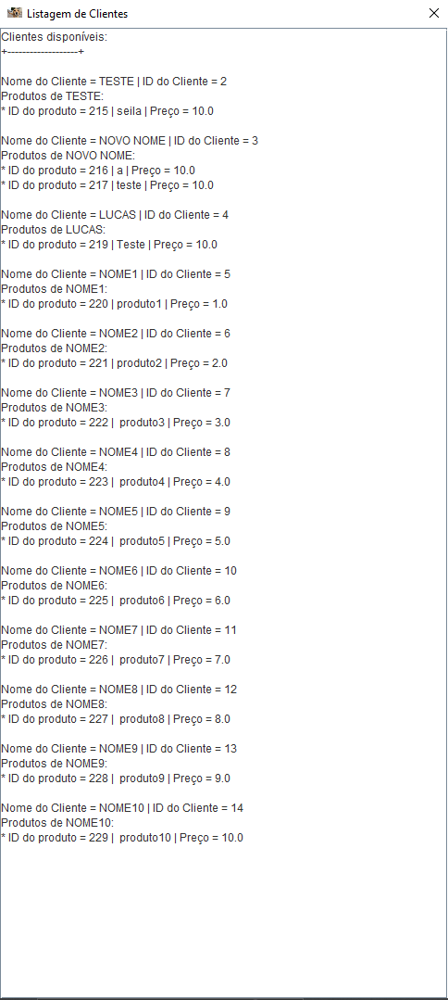

# Projeto de Extensão - Estácio
## | Objetivo principal

Distinguir o paradigma de orientação a objeto em face do paradigma estruturado, fazendo a reflexão
sobre os conceitos chaves de classe e objetos e suas coleções, para construir programas que reflitam
estruturas do mundo real.

Codificar classes, utilizando o mecanismo de herança, permitindo a criação de novas classes a partir
de classes já existentes, de forma a reaproveitar códigos já escritos.
Especificar interfaces e classes abstratas, definindo atributos, métodos e assinatura de métodos, com o
objetivo de definir um contrato na qual uma classe se compromete a fornecer o comportamento
publicado.

Empregar o mecanismo de manipulação de exceções, realizando a captura e o tratamento corretos,
para tratar situações onde a recuperação da situação de erro é possível.
Aplicar o conceito de programação paralela, utilizando o mecanismo de threads, para executar ações
cuja percepção do usuário leva a crer que estão sendo executadas ao mesmo tempo.

Construir uma aplicação que se comunique com banco de dados, utilizando a API JDBC, para realizar
operações de inserção, seleção, atualização e deleção de dados.

Além de desenvolver minhas softskills também durante o processo de aprendizado, desenvolvimento e compartilhamento dos projeto de extensão.

## | O Projeto: Sistema Gerenciador de Estoque.

Neste repositório está o projeto de extensão em java, desenvolvido por mim.

* Público Alvo: _Bancada Avaliativa_
* Tema do software: Aplicação em formato de **Sistema gerenciador de estoque automatizado.**
* Disponiblizamos: Acesso à todas as rotas.
 > Ps: As versões disponibilizadas são as últimas possiveis a serem compartilhadas para que informações sigilosas do cliente final não fosse vazado.

## | O que encontrarei nesse software?

### | Versão CLI:

* Loop de menu principal

* Funcionalidade de **ADIÇÃO**
    * Adicionar Produtos
        * Solicita ao usuário o nome do produto
        * Solicita ao usuário o preço do produto
        * Questiona se todos os produtos foram adicionados
    * Adicionar Clientes
        * Solicita ao usuário o nome do cliente
    * 
    * Adição de Produtos a Clientes existentes
        * Solicita o id do Cliente
        * Entra no loop de adição de produtos
        * 
* Funcionalidade de **EDIÇÃO**
    * Editar Produtos
        * Solicita ao usuário o novo nome do produto
        * Solicita ao usuário o novo preço do produto
        * 
    * Editar Clientes
        * Solicita ao usuário o novo nome do cliente
        * 
* Funcionalidade de **EXIBIÇÃO/LISTAGEM**
    * Lista todos os clientes e produtos diponíveis no banco de dados
    * 
* Funcionalidade de **DELEÇÃO**
    * Excluir Cliente 
        * Exibe uma listagem de todos os clientes disponíveis
        * Solicita o id do cliente para ser deletado.
        * 
    * Excluir todos os Clientes
        * Questiona se a ação deve ser mesmo efetuada
        * 
    * Deletar Produtos de Cliente Existente
        * Exibe uma listagem de todos os clientes e seus produtos
        * Solicita o id do cliente para deletar produtos
        * Exibe uma listagem de todos os produtos do cliente selecionado
        * Solicita o id do produto a ser deletado
        * 

### | Versão GUI:

* Interface Gráfica Principal
* 
* Funcionalidade de **ADIÇÃO**
* 
    * Adicionar Manualmente
        * Adicionar Produtos
            * Solicita ao usuário o nome do produto
            * Solicita ao usuário o preço do produto
            * 
            * Questiona se todos os produtos foram adicionados
            * 
        * Adicionar Clientes
            * Solicita ao usuário o nome do cliente
            * 
    * Adicionar pela Planilha
        * Exibe uma tela de loading dinâmica
        * 
        * Adiciona clientes e produtos automáticamente de uma planilha google sheets
        * 
* Funcionalidade de **EDIÇÃO**
* 
    * Editar Produtos
    * 
        * Solicita ao usuário o novo nome do produto
        * 
        * Solicita ao usuário o novo preço do produto
        * 
    * Editar Clientes
    * 
        * Solicita ao usuário o novo nome do cliente
        * 
* Funcionalidade de **EXIBIÇÃO/LISTAGEM**
    * Lista todos os clientes e produtos diponíveis no banco de dados
    * 
* Funcionalidade de **DELEÇÃO**
* 
    * Deletar Cliente
        * Exibe uma listagem de todos os clientes disponíveis
            * Solicita o id do cliente para ser deletado.
            *  
        * Excluir todos os Clientes
            * Questiona se a ação deve ser mesmo efetuada
            * 
    * Deletar Produtos 
        * Exibe uma listagem de todos os clientes e seus produtos
        * Solicita o id do cliente para deletar produtos
        * 
        * Exibe uma listagem de todos os produtos do cliente selecionado
        * Solicita o id do produto a ser deletado
        * 

## | Detalhes

### | Versão CLI:
> .vscode
>> Pasta destinada para configurações da IDE

> bin
>> Pasta destinada para as classes do java (geradas automaticamente)

> lib
>> Pasta destinada para bibliotecas externas

> src
>> Pasta destinada para desenvolvimento dos scripts em java
>>> dao
>>>> Pasta destinada para 'Decentralized Autonomous Organization'
>>
>>> db
>>>> Pasta destinada para conexão com banco de dados
>>
>>> interfaces
>>>> Pasta destinada para maior nível de abstração, contendo todas as interfaces
>>
>>> model
>>>> Pasta destinada para registro dos modelos das classes
>>
>>> service
>>>> Pasta destinada para agrupar serviços executados pelo sistema
>>
>>> thread
>>>> Pasta destinada para agrupar as threads que executarão paralelamente ao sistema
>>
>>> utils
>>>> Pasta destinada para reutilizção de código e organização da Main

### | Versão GUI:
> .vscode
>> Pasta destinada para configurações da IDE

> demo
>> Pasta destinada ao projeto (utilizando Maven)
>>> target/classes
>>>> Pasta destinada para as classes do java (geradas automaticamente)
>>
>>> src/main
>>>> java
>>>>> Pasta destinada para desenvolvimento dos scripts em java
>>>>>> dao
>>>>>>> Pasta destinada para 'Decentralized Autonomous Organization'
>>>>>
>>>>>> db
>>>>>>> Pasta destinada para conexão com banco de dados
>>>>>
>>>>>> interfaces
>>>>>>> Pasta destinada para maior nível de abstração, contendo todas as interfaces
>>>>>
>>>>>> model
>>>>>>> Pasta destinada para registro dos modelos das classes
>>>>>
>>>>>> service
>>>>>>> Pasta destinada para agrupar serviços executados pelo sistema
>>>>>
>>>>>> thread
>>>>>>> Pasta destinada para agrupar as threads que executarão paralelamente ao sistema
>>>>>
>>>>>> utils
>>>>>>> Pasta destinada para reutilizção de código e organização da Main
>>>
>>>> resources/icons
>>>>> Pasta destinada para elementos visuais

## | Tecnologias Utilizadas

**Desenvolvimento da Aplicação**

**Desenvolvimento, manipulação e hospedagem do Banco de Dados**

**Manipulação, controle e hospedagem de dados e versões**

## | Equipe

* [Lucas Gomes Leria](https://www.linkedin.com/in/lucasleria/) - Desenvolvedor UX e Programador Fullstack.

## | Fontes

* [Estácio](https://estacio.br/) - Conteúdo avançado em java; Proposta inicial do projeto extensionista. 

* [W3 Schools](https://www.w3schools.com/java/) - Documentação utilizada para aprendizagem inicial dos fundamentos básicos e intermediários do conteúdo.

* [Oracle](https://docs.oracle.com/en/java/) - Documentação oficial do Java utilizada para o desenvolvimento da aplicação.

* [Oracle - JFrame](https://docs.oracle.com/javase/8/docs/api/javax/swing/JFrame.html) - Documentação oficial do JFrame utilizada para o desenvolvimento da aplicação.

## | Anexos

* [Meu artigo](images/artigo/55e91f58922c84a3ecb5e3ce34cbcfeb094ebf1da57566505159d35d6fc8f979-1727230588255.pdf)